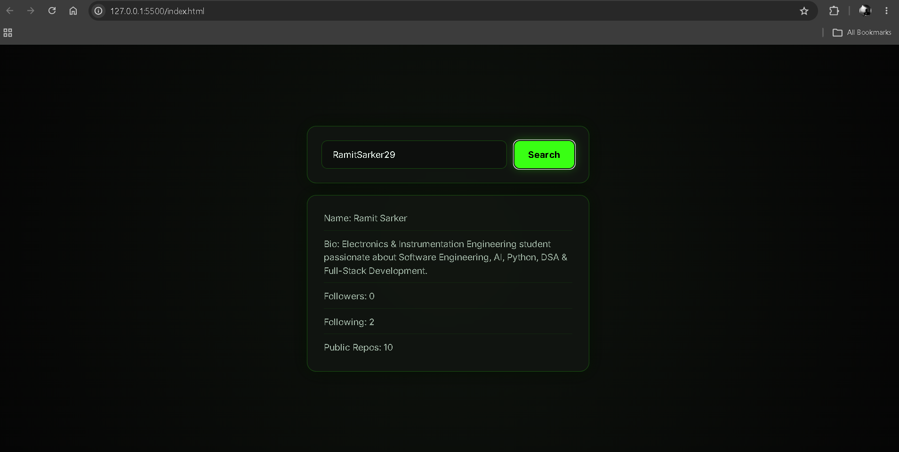
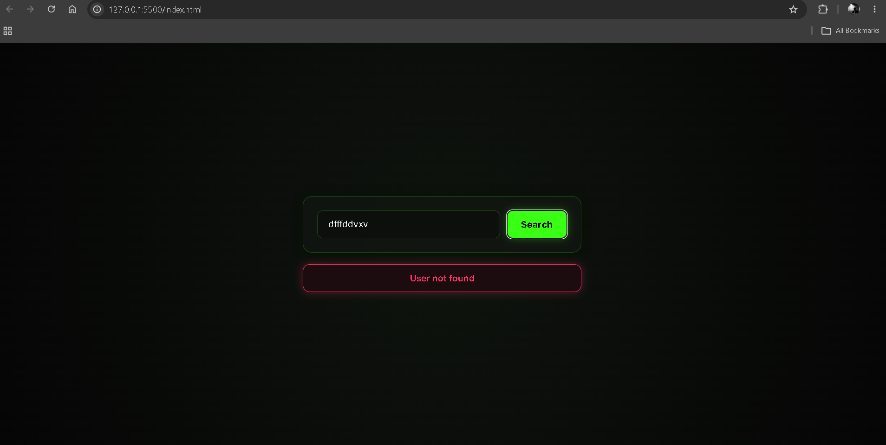

# 🔎 GitHub Profile Finder

A simple GitHub Profile Finder built with HTML, CSS, and JavaScript.

This project allows users to enter a GitHub username and retrieve profile information directly from the GitHub REST API.

---

## 🖼️ Preview





---
## 🚀 Features

- 🔎 Search for GitHub users by username
- 👤 Display the user's name
- 📝 Display the user's bio
- 👥 Display follower count
- 👥 Display following count
- 📦 Display number of public repositories
- ❌ Handle invalid GitHub usernames
- ⚡ Fetch data dynamically without reloading the page
- 📱 Responsive interface

---

## 🛠️ Technologies Used

- HTML5
- CSS3
- JavaScript (ES6+)
- DOM Manipulation
- Fetch API
- Async/Await
- REST API
- Error Handling

---

## 📡 API Used

This project uses the GitHub REST API to retrieve public user information.

The application dynamically creates an API endpoint based on the username entered by the user.

```text
https://api.github.com/users/{username}
````

The response is converted from JSON into a JavaScript object and then used to update the webpage. 

---

## 🧠 Concepts Practiced

### DOM Manipulation

Selecting HTML elements and updating their content dynamically using:

* `getElementById()`
* `textContent`
* `classList`

### Event Handling

Handling user interaction with:

* `click` events
* Button interactions
* User input

### Fetch API

Making HTTP requests to an external API using:

* `fetch()`
* `async`
* `await`
* `response.json()`

### API Error Handling

Checking whether the API request was successful and throwing an error when a user cannot be found. 

### Object Destructuring

Extracting useful properties from the GitHub API response:

```javascript
const { name, followers, following, bio, public_repos } = data
```

### Dynamic UI Updates

The profile information is inserted into the page after the API request completes. 

### Conditional UI

The profile card is shown when a user is found, while the error message is shown when the request fails. 

---

## 🎨 Design

The interface uses a dark theme with neon-green accents, responsive layout, glowing borders, and a glass-style card design. 

The profile information is displayed inside a responsive card containing the user's information. 

---

## 📂 Project Structure

```text
github-profile-finder/
│
├── index.html
├── styles.css
└── script.js
```

---

## ▶️ How It Works

```text
User enters GitHub username
          ↓
       Search
          ↓
   Build API URL
          ↓
     fetch() request
          ↓
   GitHub API response
          ↓
      JSON data
          ↓
    Extract profile data
          ↓
      Update DOM
```

---

## 📚 What I Learned

This project helped me practice working with external APIs and understand the complete API workflow:

* Taking user input
* Building an API endpoint dynamically
* Sending API requests
* Working with asynchronous JavaScript
* Handling API responses
* Converting JSON into JavaScript data
* Extracting information from objects
* Displaying API data in the DOM
* Handling failed requests
* Separating API logic from display logic

---

## 🎯 Future Improvements

Possible improvements for this project:

* 🖼️ Add the user's GitHub avatar
* 🔗 Add a link to the user's GitHub profile
* 📅 Display account creation date
* 📊 Display repository statistics
* ⭐ Display starred repositories
* 🔍 Add repository search
* 💾 Save recent searches using Local Storage
* ⌨️ Allow searching by pressing Enter
* 🎨 Improve the profile card design
* ⏳ Add a loading state while fetching data

---

## 💡 Purpose

This project is part of my frontend development learning journey.

The goal is not just to build the application, but to understand how frontend applications communicate with external APIs and turn API data into an interactive user interface.

---

## 👨‍💻 Author

**Ramit Sarker**
