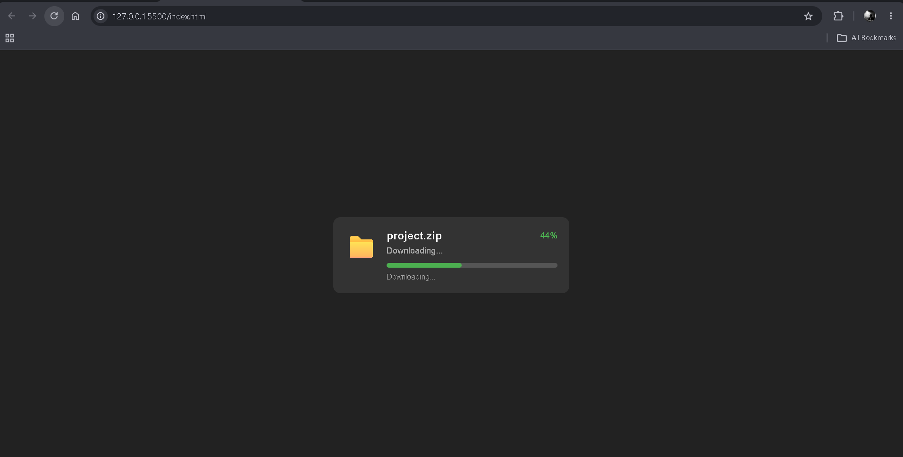
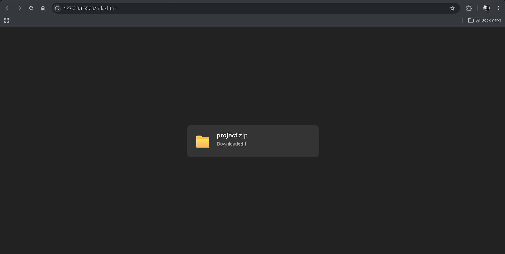

# ⬇️ Download Simulation

A simple **Download Simulation** built with HTML, CSS, and JavaScript.

The project visually simulates a file being downloaded by gradually increasing a progress bar and percentage. Once the download reaches 100%, the progress bar disappears and the status changes to indicate that the download is complete.

---

## 🚀 Purpose

The goal of this project was to practice:

- `setInterval()`
- Updating the DOM dynamically
- Changing CSS properties with JavaScript
- Working with percentages
- Using conditional statements
- Managing UI state

---

## ✨ Features

- 📁 Download-style interface
- 📊 Animated progress bar
- 🔢 Live download percentage
- ⏳ Simulated download progress
- ✅ Completion message
- 👻 Progress bar hides when the download finishes

---

## 📚 Concepts Practiced

- DOM Manipulation
- `getElementById()`
- `querySelector()`
- `textContent`
- `style.width`
- `classList.add()`
- `setInterval()`
- Conditional Statements
- `if`
- Incrementing variables
- Percentage-based UI updates
- CSS Flexbox
- CSS `display: none`

---

## 🔄 How It Works

The download starts at `0%` and increases by `1%` every `50ms`.

```text
0%
 ↓
1%
 ↓
2%
 ↓
...
 ↓
99%
 ↓
100%
 ↓
Downloaded!!
```

The progress bar width is updated along with the percentage. When the counter reaches `100%`, the progress bar is hidden and the completion message is displayed. 

---

## 📸 Screenshots

### Downloading



### Download Complete



---

## 🎯 What I Learned

- How `setInterval()` can be used to repeatedly execute code
- How to update DOM content dynamically
- How to change an element's CSS using JavaScript
- How to create a simple progress animation
- How to hide elements using `classList`
- How JavaScript can control the visual state of a webpage

---

## 📌 Note

This is a **visual download simulation** and does not download an actual file.

It was built as part of my **frontend development learning journey** to practice JavaScript timing functions and dynamic UI updates.

---

## 👨‍💻 Author

**Ramit Sarker**
