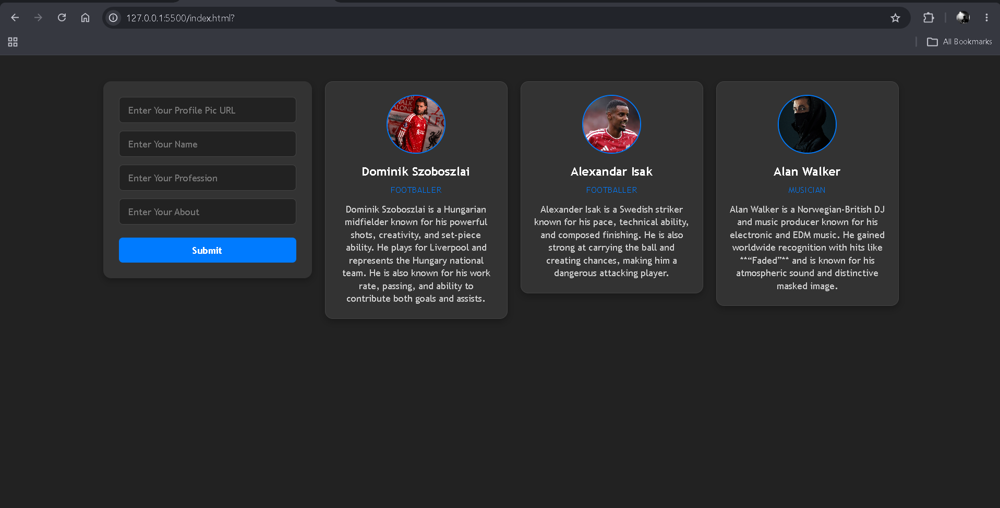

# 👤 Dynamic Profile Card Generator

A simple JavaScript project that allows users to create **profile cards dynamically** by entering a profile picture URL, name, profession, and a short description.

The project creates the entire profile card using JavaScript and adds it to the webpage without reloading the page.

---

## 🖼️ Preview



---

## 🚀 Features

* 👤 Create profile cards dynamically
* 🖼️ Add a profile picture using an image URL
* 📝 Add a name
* 💼 Add a profession
* 📄 Add an "About" description
* ⚡ Generate cards without refreshing the page
* 🧹 Automatically clear the form after submission
* 📱 Create multiple profile cards

---

## 🛠️ Technologies Used

* HTML5
* CSS3
* JavaScript
* DOM Manipulation
* Event Handling
* Forms
* Dynamic DOM Elements
* Flexbox

---

## 🧠 How It Works

The user enters four pieces of information:

* Profile picture URL
* Name
* Profession
* About

These values are collected from the form and used to create a new profile card dynamically.

When the form is submitted, JavaScript prevents the default page refresh:

```js
e.preventDefault()
```

The project then creates the required elements using:

```js
document.createElement()
```

The user's information is inserted using `textContent`, while the profile image URL is added using `setAttribute()`.

The elements are then assembled into a card:

```text
card
├── profile
│   └── image
├── name
├── profession
└── about
```

Finally, the completed card is added to the main container.

---

## 🔄 Application Flow

```text
User enters profile information
            ↓
       Submit form
            ↓
   Prevent page refresh
            ↓
   Create DOM elements
            ↓
   Insert user information
            ↓
     Assemble the card
            ↓
    Add card to webpage
            ↓
      Clear the form
```

---

## 🎨 Design

The project uses a dark interface with blue accents.

The main container uses Flexbox, allowing multiple profile cards to appear and wrap across the page.

Each profile card contains:

* Circular profile image
* Name
* Profession
* About section

The profile image uses:

```css
object-fit: cover;
```

so the image fills the circular container without being distorted.

---

## 📚 Concepts Practiced

* Form submission
* `preventDefault()`
* `querySelector()`
* `querySelectorAll()`
* Reading input values
* `createElement()`
* `classList.add()`
* `setAttribute()`
* `textContent`
* `append()`
* `appendChild()`
* Dynamic DOM creation
* Building nested DOM structures
* Working with user input
* Clearing form inputs
* `forEach()`
* CSS Flexbox
* CSS transitions
* CSS hover states
* Responsive card layouts
* `object-fit: cover`

---

## 💡 What I Learned

This project helped me understand how JavaScript can be used to **build HTML elements dynamically instead of writing every element directly in HTML**.

The main idea was:

> **Take user input → create DOM elements → put the data inside them → assemble them into a card → add the card to the page.**

This helped me practice creating and managing DOM elements based on user input.

---

## 📂 Project Structure

```text
dynamic-profile-card/
│
├── index.html
├── style.css
├── script.js
├── Screenshot 2026-08-27 050118.png
└── README.md
```

---

## 🎯 Future Improvements

Possible improvements:

* 🗑️ Add a delete button to each card
* ✏️ Add an edit button
* 💾 Save cards using Local Storage
* 📸 Add image preview before creating the card
* ✅ Validate form fields
* 🎨 Add different card themes
* 📱 Improve mobile responsiveness

---

## 👨‍💻 Author

**Ramit Sarker**
