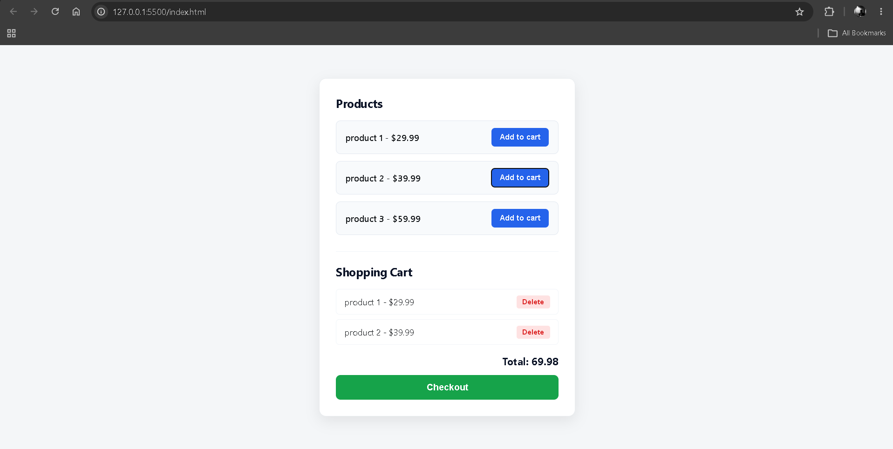

# 🛒 Simple E-Commerce Cart

A simple e-commerce shopping cart built with **HTML, CSS, and JavaScript**.

This project allows users to add products to a shopping cart, remove individual items, keep their cart saved after refreshing the page, and clear the cart through checkout. Products and cart items are dynamically rendered using JavaScript. 

---

## 🖼️ Preview



---

## 🚀 Features

* 🛍️ Display available products
* ➕ Add products to the shopping cart
* 🗑️ Delete individual products from the cart
* 💾 Persist cart data using Local Storage
* 🔄 Restore cart items after refreshing the page
* 💰 Calculate the total cart price dynamically
* 🛒 Display an empty-cart message when there are no items
* ✅ Checkout and clear the cart
* ⚡ Dynamically update the UI without reloading the page

---

## 🛠️ Technologies Used

* HTML5
* CSS3
* JavaScript (ES6+)
* DOM Manipulation
* Event Handling
* JavaScript Arrays
* Array Methods
* Local Storage
* JSON
* Dynamic DOM Elements

---

## 🧠 Concepts Practiced

### DOM Manipulation

Creating and updating elements dynamically using:

* `createElement()`
* `appendChild()`
* `innerHTML`
* `textContent`
* `classList`

The product list itself is generated dynamically from the JavaScript `products` array. 

### Event Handling

Handling button clicks for:

* Adding products
* Deleting products
* Checking out

Event listeners are attached to dynamically generated product and delete buttons. 

### Local Storage

The cart is saved in the browser using:

```javascript
localStorage.setItem(
    'productData',
    JSON.stringify(cart)
)
```

When the page loads, the saved cart is retrieved using `JSON.parse()`. 

### Array Methods

This project practices several useful array operations:

* `push()` — add an item to the cart
* `find()` — find a product by ID
* `findIndex()` — find an item's position in the cart
* `splice()` — remove an item from the cart
* `forEach()` — loop through products and cart items

### JSON

Local Storage can only store strings, so the cart is converted between JavaScript data and JSON:

```javascript
JSON.stringify(cart)
```

and:

```javascript
JSON.parse(...)
```

---

## 🔄 How It Works

```text
User clicks "Add to cart"
          ↓
Find product by ID
          ↓
Add product to cart array
          ↓
Save cart to Local Storage
          ↓
renderCart()
          ↓
Update the webpage
```

### Deleting an Item

```text
User clicks "Delete"
          ↓
Get product ID
          ↓
Find item's index in cart
          ↓
Remove item using splice()
          ↓
Update Local Storage
          ↓
renderCart()
```

The delete functionality uses `findIndex()` and `splice()` to remove the selected item, then saves the updated cart and re-renders it. 

---

## 🔄 Cart Persistence

One of the main features of this project is that the cart doesn't disappear when the page is refreshed.

The saved cart is loaded when the application starts:

```javascript
const cart =
    JSON.parse(localStorage.getItem('productData')) || []
```

Then `renderCart()` displays the saved items on the page. 

---

## 🎨 Design

The interface uses a clean and minimal e-commerce design with:

* Light background
* White card layout
* Blue **Add to Cart** buttons
* Red **Delete** buttons
* Green **Checkout** button
* Responsive centered container
* Hover effects

The main application container is limited to `440px` wide and uses a card-style layout. 

---

## 📂 Project Structure

```text
simple-e-commerce/
│
├── index.html
├── styles.css
└── script.js
```

---

## 🧩 Main Functions

### `addToCart()`

Adds the selected product to the cart, saves the updated cart to Local Storage, and updates the UI. 

### `renderCart()`

Responsible for displaying the current contents of the cart and calculating the total price.

It also handles the empty-cart state. 

### Checkout

The checkout button clears the cart and removes the saved cart data from Local Storage. 

---

## 📚 What I Learned

This project helped me practice:

* Working with JavaScript arrays
* Creating dynamic HTML elements
* Handling button events
* Using `data-*` attributes
* Finding objects inside arrays
* Removing objects from arrays
* Using `localStorage`
* Converting data with JSON
* Keeping application state synchronized with the UI
* Understanding the purpose of a render function
* Updating the UI after data changes
* Building a simple persistent shopping cart

---

## 🎯 Future Improvements

Possible improvements for this project:

* 🔢 Add product quantities
* ➕ Add increase/decrease quantity buttons
* 💰 Add tax calculation
* 🚚 Add shipping cost
* 🎨 Add product images
* 🔍 Add product search
* 🏷️ Add product categories
* 💳 Create a more realistic checkout page
* 💾 Store product data separately from cart data
* 📱 Further improve mobile responsiveness

---

## 💡 Purpose

This project was built to practice **JavaScript fundamentals and browser storage** by creating a realistic mini e-commerce application.

The main focus was understanding how application data can be stored, modified, persisted, and then rendered back into the webpage.

---

## 👨‍💻 Author

**Ramit Sarker**
