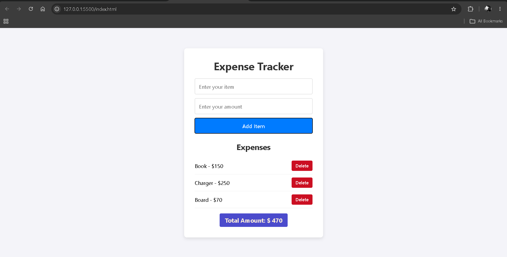

# 💰 Expense Tracker

A simple **Expense Tracker** built with HTML, CSS, and JavaScript.

This project allows users to add expenses, calculate their total spending, delete individual expenses, and keep their expense data saved even after refreshing the page using **Local Storage**. The interface is designed to be responsive and mobile-friendly. 

---

## 🖼️ Preview



---

## 🚀 Features

* 💰 Add an expense with an item name and amount
* 📋 Display all added expenses dynamically
* 🧮 Calculate the total amount automatically
* 🗑️ Delete individual expenses
* 💾 Save expenses using Local Storage
* 🔄 Restore expenses after refreshing the page
* ❌ Validate empty item names and invalid amounts
* 📱 Responsive design for smaller screens
* ⚡ Update the interface dynamically without page reloads

---

## 🛠️ Technologies Used

* HTML5
* CSS3
* JavaScript (ES6+)
* DOM Manipulation
* Event Handling
* JavaScript Arrays
* Array Methods
* Local Storage
* JSON
* `Date.now()`
* Responsive CSS
* Flexbox

---

## 🧠 Concepts Practiced

### DOM Manipulation

The application creates expense list items dynamically using:

* `createElement()`
* `innerHTML`
* `appendChild()`
* `textContent`
* `innerHTML = ''`

Each expense is converted into an `<li>` element and added to the expense list. 

### Form Handling

The project uses the form's `submit` event and prevents the browser's default form submission behavior:

```javascript
form.addEventListener('submit', (e) => {
    e.preventDefault()
})
```

The entered item and amount are then validated before being added. 

### Local Storage

Expenses are stored in the browser using Local Storage:

```javascript
localStorage.setItem(
    'itemsData',
    JSON.stringify(itemsArray)
)
```

The saved data is loaded when the application starts using `JSON.parse()`. 

### Array Methods

This project practices:

* `push()` — adding expenses
* `forEach()` — displaying expenses
* `filter()` — deleting expenses
* `reduce()` — calculating the total

### Reduce

The total expense is calculated using:

```javascript
itemsArray.reduce(
    (sum, items) => sum + items.itemPrice,
    0
)
```

This goes through every expense and adds its amount to the running total. 

### Delete Functionality

Each expense receives a unique ID using:

```javascript
id: Date.now()
```

The ID is placed on the Delete button as a `data-id` attribute. When the button is clicked, `filter()` removes the matching expense from the array.  

---

## 🔄 How It Works

```text
User enters expense
        ↓
Submit form
        ↓
Validate input
        ↓
Create expense object
        ↓
Add to itemsArray
        ↓
Save to Local Storage
        ↓
Render expenses
        ↓
Calculate total
        ↓
Update UI
```

### Deleting an Expense

```text
Click Delete
      ↓
Get expense ID
      ↓
Filter the item from array
      ↓
Save updated array
      ↓
Render list again
      ↓
Recalculate total
```

---

## 💾 Data Persistence

The expense data remains available after refreshing the browser because the application stores the array in Local Storage.

On page load:

```javascript
JSON.parse(localStorage.getItem('itemsData')) || []
```

This means previously added expenses can be restored instead of starting with an empty array.

---

## 🎨 Design

The interface uses a clean, minimal layout with:

* Light background
* Centered card
* Responsive form
* Blue Add Item button
* Red Delete buttons
* Purple total amount display
* Scrollable expense list

The main container uses a responsive width with a `max-width` of `420px`, while the form uses Flexbox with a vertical layout and consistent spacing.  

The total amount box uses `width: fit-content` and auto margins so it wraps around its content instead of stretching across the entire container. 

---

## 📂 Project Structure

```text
expense-tracker/
│
├── index.html
├── styles.css
└── script.js
```

---

## 📚 What I Learned

This project helped me practice:

* Handling form submissions
* Using `preventDefault()`
* Reading and validating user input
* Converting strings to numbers with `parseFloat()`
* Creating JavaScript objects
* Generating unique IDs with `Date.now()`
* Working with arrays
* Using `push()`, `forEach()`, `filter()`, and `reduce()`
* Dynamically creating HTML elements
* Using `data-*` attributes
* Updating the DOM
* Calculating values from arrays
* Using Local Storage
* Converting data with `JSON.stringify()` and `JSON.parse()`
* Keeping application data synchronized with the UI
* Creating responsive layouts with CSS
* Using media queries

---

## 🎯 Future Improvements

Possible improvements for this project:

* 📅 Add expense dates
* 🏷️ Add expense categories
* 📊 Add spending charts
* 🔍 Add expense search
* ↕️ Add sorting by amount or date
* 💰 Add monthly spending limits
* 📈 Show spending statistics
* ✏️ Add an edit expense feature
* 🌙 Add dark mode
* 📤 Add an option to export expenses
* 💵 Add currency selection

---

## 💡 Purpose

This project was built as part of my **frontend development learning journey**.

The main goal was to practice working with **JavaScript data, DOM manipulation, Local Storage, array methods, and dynamic UI updates** by building something practical rather than only practicing individual concepts.

---

## 👨‍💻 Author

**Ramit Sarker**
