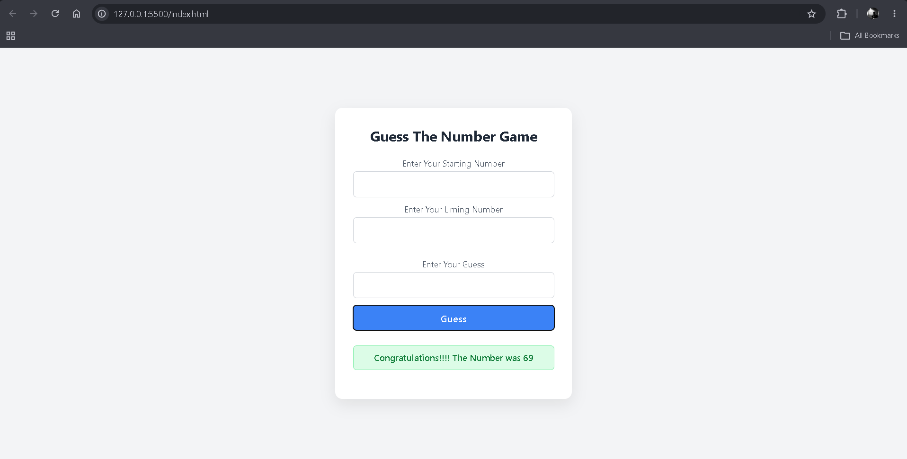
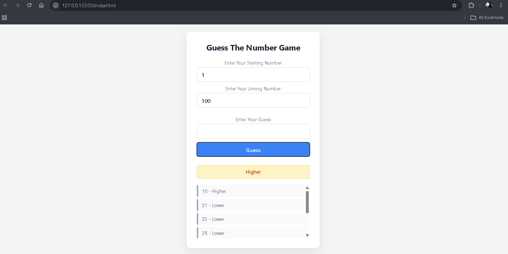

# 🎯 Guess The Number Game

A simple and interactive **Guess The Number Game** built using HTML, CSS, and JavaScript.

The user chooses a starting and limiting number, and the game randomly generates a number within that range. The player then makes guesses and receives feedback telling them whether they should guess **Higher** or **Lower** until they find the correct number.

---

## 🎨 Preview

### Game Setup



### Guessing in Progress



---

## 🚀 Features

* 🎯 Generate a random number within a user-defined range
* 🔢 Allow users to choose the starting and limiting numbers
* ⬆️ Tell the user to guess **Higher**
* ⬇️ Tell the user to guess **Lower**
* 🎉 Display a congratulations message when the number is guessed
* ❌ Prevent guesses outside the selected range
* 📝 Keep track of previous guesses
* 🔄 Reset the game after successfully guessing the number
* 🎨 Different colors for different feedback states
* 📱 Responsive layout

The guessing section is initially hidden and appears after the user starts the game.  

---

## 🛠️ Technologies Used

* HTML5
* CSS3
* JavaScript (ES6+)
* DOM Manipulation
* Event Handling
* `Math.random()`
* `Math.floor()`
* Conditional Statements
* Dynamic DOM Elements

---

## 🧠 How It Works

The user first enters:

1. Starting number
2. Limiting number

After clicking **Start**, JavaScript generates a random number between those two values.

```javascript
Math.floor(Math.random() * (limit - start + 1)) + start
```

The game then displays the guessing section and hides the Start button.  

The player enters a guess and the game checks it against the randomly generated number.

```text
User enters range
        ↓
      Start
        ↓
Generate random number
        ↓
   Enter a guess
        ↓
 ┌──────┼───────┐
 ↓      ↓       ↓
Higher Lower   Correct
 ↓      ↓       ↓
Guess   Guess   Win 🎉
again   again
```

---

## 🎮 Feedback System

The game provides different feedback depending on the player's guess.

### ⬆️ Higher

If the guessed number is smaller than the random number:

```text
Higher
```

### ⬇️ Lower

If the guessed number is greater than the random number:

```text
Lower
```

### 🎉 Correct

If the player guesses the correct number:

```text
Congratulations!!!! The Number was 69
```

### ❌ Out of Range

If the player enters a number outside the selected range:

```text
Please Enter Within Range
```

These states are styled separately using `.higher`, `.lower`, `.correct`, and `.error` classes. 

---

## 📝 Guess History

Every incorrect guess is added to the guess history.

For example:

```text
10 - Higher
21 - Lower
25 - Lower
28 - Lower
```

The newest guess appears at the top of the list using `prepend()`. 

The history is cleared when the player wins.

---

## 🔄 Game Reset

After the player correctly guesses the number:

* The congratulations message is displayed
* The guess history is cleared
* The starting number input is cleared
* The limiting number input is cleared
* The guess input is cleared
* The guessing section disappears
* The Start button appears again

This allows the player to immediately start a new game. 

---

## 📂 Project Structure

```text
guess-the-number/
│
├── index.html
├── styles.css
├── script.js
│
└── preview/
    ├── guessing-game-start.png
    └── guessing-game-gameplay.png
```

The HTML contains the game inputs, Start button, guessing interface, feedback area, and guess history. 

---

## 📚 Concepts Practiced

This project helped me practice:

* DOM selection
* `addEventListener()`
* Click events
* Variables and scope
* `let`
* `const`
* `parseInt()`
* `.value`
* `.textContent`
* `.className`
* `.classList`
* Conditional statements
* Comparison operators
* Strict equality
* `Math.random()`
* `Math.floor()`
* Template literals
* `createElement()`
* `appendChild()`
* `prepend()`
* Dynamic UI updates
* Showing and hiding elements
* Resetting application state
* Managing multiple event listeners

---

## 💡 What I Learned

While building this project, I practiced how to:

* Generate random numbers within a specific range
* Work with values from HTML inputs
* Convert input values from strings to numbers
* Compare user input with a generated value
* Dynamically update webpage content
* Add elements to the DOM
* Change CSS classes using JavaScript
* Show and hide elements dynamically
* Keep game state using JavaScript variables
* Reset the application after completing a game

---

## 🎯 Future Improvements

Possible improvements for the project:

* 🔢 Add a maximum number of attempts
* 🏆 Add a score system
* 📊 Track the number of guesses
* 🥇 Add difficulty levels
* ⏱️ Add a timer
* 🔊 Add sound effects
* 🌙 Add a dark mode
* 🎉 Add a better winning animation
* ⌨️ Allow pressing **Enter** to submit a guess
* 🔄 Add a dedicated **New Game** button

---

## 🎯 Purpose

This project is part of my frontend development learning journey.

The goal was to practice JavaScript by building a small interactive application instead of only learning syntax theoretically.

It helped me understand how JavaScript can control the DOM, respond to user actions, maintain state, and dynamically change the UI.

---

## 👨‍💻 Author

**Ramit Sarker**
