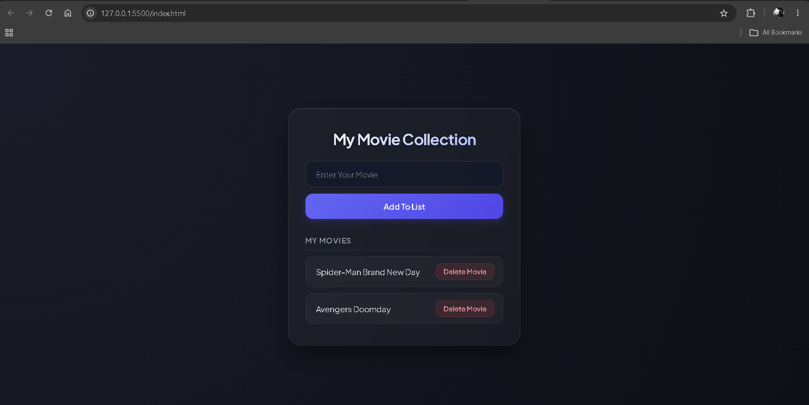

# 🎬 Movie Collection

A simple movie collection app built with HTML, CSS, and JavaScript.

This project was built as a JavaScript practice project to become more comfortable with DOM manipulation, arrays, events, and Local Storage.

## 📸 Preview



## ✨ Features

- ➕ Add movies to your collection
- 📝 Display movies dynamically
- 🗑️ Delete movies from your collection
- 💾 Save movies using Local Storage
- 🔄 Restore movies after refreshing the page
- 🚫 Prevent empty movie entries

## 🛠️ Technologies Used

- HTML5
- CSS3
- JavaScript
- DOM Manipulation
- Local Storage

## 🧠 Concepts Practiced

- `addEventListener()`
- `.value`
- `.trim()`
- Arrays
- `push()`
- `splice()`
- `for` loops
- Functions
- `createElement()`
- `appendChild()`
- `textContent`
- `innerHTML`
- `JSON.stringify()`
- `JSON.parse()`
- `localStorage.setItem()`
- `localStorage.getItem()`

## 💾 Local Storage

Movies are stored in the browser using Local Storage.

When adding a movie, the `movies` array is converted to JSON and saved:

```js
localStorage.setItem('movies', JSON.stringify(movies))
````

When the page loads, the saved data is retrieved and converted back into an array:

```js
let movies = JSON.parse(localStorage.getItem('movies')) || []
```

## ⚙️ How It Works

1. Enter a movie name.
2. Click **Add To List**.
3. The movie is added to the `movies` array.
4. The updated array is saved to Local Storage.
5. `renderList()` displays the movies on the page.
6. Each movie gets its own **Delete Movie** button.
7. Clicking delete removes the movie from the array.
8. The updated array is saved again and the list is re-rendered.
9. Refreshing the page restores the saved movies.

## 📂 Project Structure

```text
Movie-Collection/
├── index.html
├── styles.css
├── script.js
├── screenshot.png
└── README.md
```

## 🎨 Design

The app uses a dark, modern interface with:

* Glassmorphism styling
* Gradient background
* Rounded cards
* Styled input and buttons
* Interactive hover effects
* Responsive layout

## 📚 What I Learned

This project helped me understand how JavaScript data and the DOM work together.

The `movies` array stores the movie data, while `renderList()` uses that data to create and display the movie elements on the page.

I also learned how Local Storage can be used to persist data so that movies remain available after refreshing the browser.

## 🎯 Purpose

This is a small learning project built as part of my frontend development journey.

The goal was to practice JavaScript by building something functional and realistic while becoming more comfortable with:

* Managing data with arrays
* Working with the DOM
* Handling user events
* Using Local Storage
* Rendering dynamic content
* Separating data from the UI

## 👨‍💻 Author

**Ramit Sarker**
