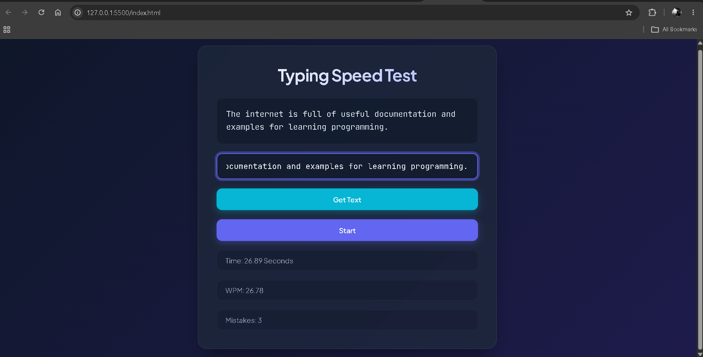

# ⌨️ Typing Speed Test

A simple typing speed test built with **HTML, CSS, and JavaScript**.

This project was built as a JavaScript practice project to improve my understanding of DOM manipulation, events, arrays, string methods, timers, and basic calculations.

---

## 📸 Preview



---

## ✨ Features

- 🎲 Generate a random typing sentence
- ⏱️ Measure typing time
- 📝 Detect when the user completes the sentence
- ⚡ Calculate Words Per Minute (WPM)
- ❌ Track typing mistakes
- 🔄 Allow mistakes to be corrected while still keeping track of them
- 📚 Use a collection of programming-related sentences
- 📱 Responsive layout

---

## 🛠️ Technologies Used

- HTML5
- CSS3
- JavaScript (ES6+)
- DOM Manipulation
- Event Listeners
- Arrays
- String Methods
- `Date.now()`
- `Math.random()`
- `Math.floor()`

---

## 🧠 Concepts Practiced

### DOM Manipulation

Used JavaScript to select and update HTML elements dynamically.

### Random Text Generation

A random sentence is selected from an array using:

```js
Math.floor(Math.random() * texts.length)
````

### Event Handling

The project uses events such as:

* `click`
* `input`
* `DOMContentLoaded`

### Timer

The typing time is calculated using timestamps from `Date.now()`.

The difference between the start and end timestamps is converted from milliseconds to seconds.

### WPM Calculation

The project calculates Words Per Minute based on the number of words typed and the time taken.

```text
WPM = (word count × 60) / time in seconds
```

### Mistake Tracking

Each newly typed character is compared with the corresponding character in the target sentence.

Mistakes remain counted even if the user later corrects them.

---

## 📂 Project Structure

```text
typing-speed/
│
├── index.html
├── script.js
├── style.css
└── ss_typing_speed.png
```

---

## 🚀 How It Works

1. Click **Get Text** to generate a random sentence.
2. Click **Start** to begin the timer.
3. Type the displayed sentence.
4. JavaScript compares the typed text with the target text.
5. When the sentence is completed:

   * The elapsed time is calculated.
   * WPM is calculated.
   * The number of mistakes is displayed.

---

## 🎯 What I'm Learning

This project helped me practice:

* Working with the DOM
* Handling user input
* Working with arrays
* Using `split()` and `length`
* Generating random values
* Working with timestamps
* Comparing strings character by character
* Managing variables across event listeners
* Building logic step by step

---

## 💡 Future Improvements

* Add a reset button
* Add different difficulty levels
* Add more typing sentences
* Calculate a percentage-based accuracy score
* Prevent starting a test before selecting text
* Disable buttons while a test is running
* Add a countdown before the test starts
* Add a high-score system

---

## 👨‍💻 Author

**Ramit Sarker**

```

