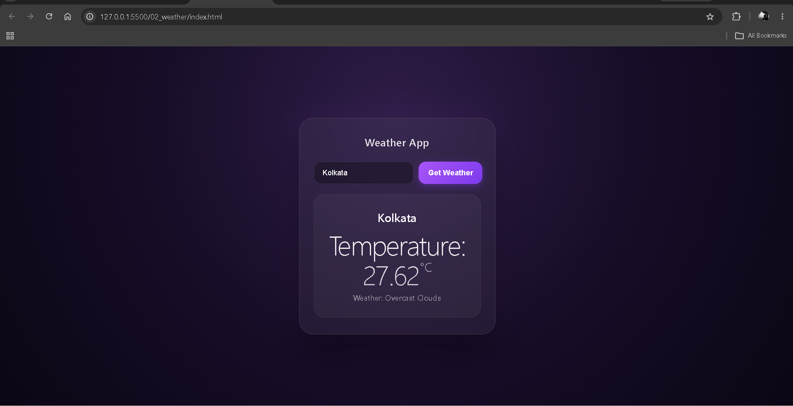

# 🌤️ Weather App

A simple weather app built with HTML, CSS, and JavaScript.

This project was built to practice working with APIs, asynchronous JavaScript, `fetch()`, `async/await`, and dynamically updating the DOM based on API data.

## 📸 Preview



## ✨ Features

- 🌍 Search weather by city name
- 🌡️ Display the current temperature
- ☁️ Display the current weather condition
- ⚠️ Show an error message when a city cannot be found
- 🔄 Update weather information dynamically
- 📡 Fetch real-time weather data from an API
- 📱 Responsive and modern UI

## 🛠️ Technologies Used

- HTML5
- CSS3
- JavaScript (ES6+)
- DOM Manipulation
- Fetch API
- OpenWeather API
- Async/Await
- Promises

## 📚 Concepts Practiced

- `addEventListener()`
- DOM Manipulation
- `.value`
- `.trim()`
- `fetch()`
- Promises
- `async/await`
- `try...catch`
- HTTP response handling
- `response.ok`
- `response.json()`
- Template Literals
- Object Destructuring
- Functions
- Conditional Statements
- CSS Classes
- Dynamic DOM Updates

## ⚙️ How It Works

1. Enter a city name in the search box.
2. Click **Get Weather**.
3. JavaScript sends a request to the OpenWeather API.
4. The API returns weather data for the requested city.
5. The application extracts the city name, temperature, and weather description.
6. The weather information is displayed dynamically on the page.
7. If the city cannot be found, an error message is displayed.

## 🌐 API

This project uses the **OpenWeather API** to retrieve weather information.

The application sends the city name to the weather API and requests the temperature in Celsius.

## 🧠 What I Learned

This project introduced me to working with external APIs and asynchronous JavaScript.

I learned how to:

- Make requests using `fetch()`
- Wait for asynchronous operations using `async/await`
- Handle errors using `try...catch`
- Check whether an HTTP request was successful
- Convert API responses into JavaScript objects
- Extract useful information from API data
- Display API results dynamically in the DOM

## 🎨 Design

The app uses a modern dark interface with:

- Purple gradient background
- Glassmorphism styling
- Rounded cards
- Gradient buttons
- Animated weather information
- Responsive layout

## 📂 Project Structure

```text
weather-app/
├── index.html
├── styles.css
├── script.js
├── screenshot.png
└── README.md
````

## 🎯 Purpose

This project is part of my frontend development learning journey.

The main goal was to move beyond static JavaScript projects and learn how frontend applications communicate with external services and use the returned data to update the UI.

## 📌 Note

This project is primarily focused on practicing API requests and asynchronous JavaScript.

As I continue learning, I plan to improve the application by adding more weather information, better error handling, loading states, and additional features.

## 👨‍💻 Author

**Ramit Sarker**
