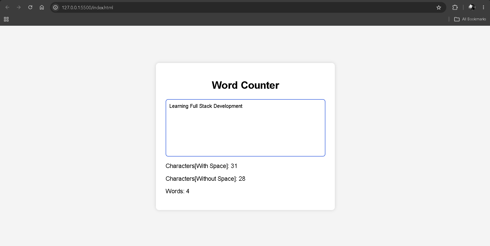

# 📝 Word Counter

A simple **Word Counter** built with **HTML, CSS, and JavaScript**.

This project updates the character and word count **live** as the user types. It was built to practice JavaScript fundamentals such as DOM manipulation, event listeners, string methods, and real-time UI updates.


## 📸 Preview




## ✨ Features

- Live character count (including spaces)
- Live character count (excluding spaces)
- Live word count
- Updates instantly while typing
- Clean and responsive interface :contentReference[oaicite:1]{index=1}

---

## 🛠️ Technologies Used

- HTML5
- CSS3
- JavaScript (ES6)

---

## 📂 Project Structure

```text
Word-Counter/
│
├── index.html
├── styles.css
├── script.js
└── README.md
```

---

## 📚 Concepts Practiced

While building this project, I practiced:

- DOM Manipulation
- `getElementById()`
- `addEventListener()`
- `input` event
- Reading user input with `.value`
- Updating the DOM using `textContent`
- String methods:
  - `.length`
  - `.split()`
  - `.replaceAll()`
- Conditional statements (`if...else`) :contentReference[oaicite:2]{index=2}

---

## ▶️ How It Works

1. The user types into the text area.
2. JavaScript listens for the `input` event.
3. The application:
   - Counts all characters.
   - Counts characters excluding spaces.
   - Counts the number of words.
4. The results update instantly on the page. :contentReference[oaicite:3]{index=3}

---

## 🚀 Future Improvements

- Handle multiple spaces between words more accurately
- Ignore leading and trailing spaces automatically
- Display reading time
- Add a maximum character limit
- Show sentence and paragraph count

---

## 📄 Author
**Ramit Sarker**

